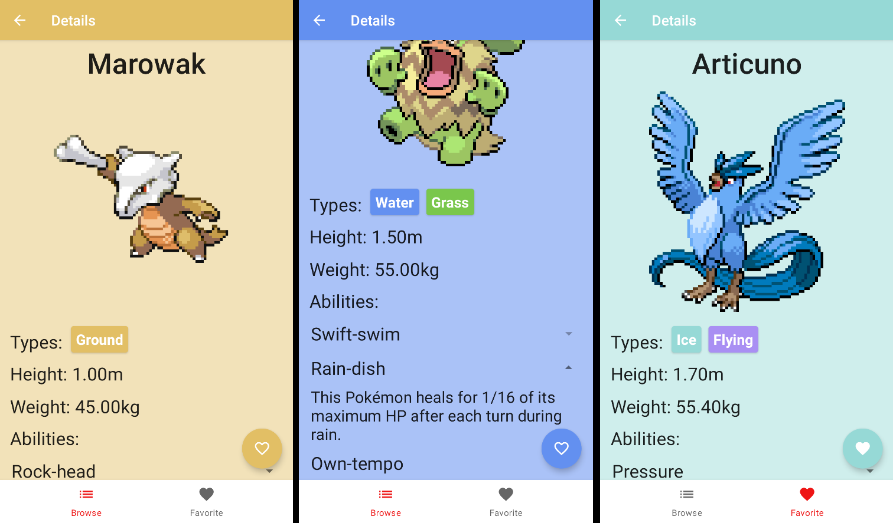
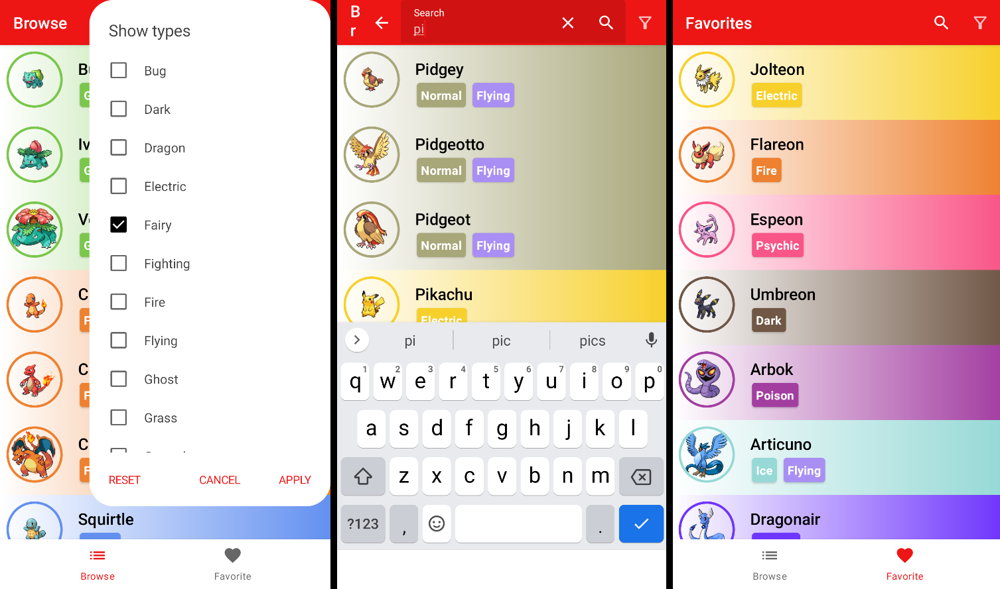

# Pokedex
A Pokedex app for Android, made with awesome [PokeApi](https://pokeapi.co).

The goal of the project was to get familiar with Android frameworks and try to follow Google's [clean architecture guidelines](https://developer.android.com/topic/architecture). The result is an offline-first app, which lets you browse different Pokemon with search and filter features, preview selected Pokemon details and save them to your collection. 

Written in Kotlin using:
- Jetpack Compose & Jetpack Navigation Component for UI
- Room & Retrofit for fetching and storing data
- Hilt for DI
- Gradle for automated build
- Timber for logging
- JUnit for unit testing





### Build and install
Recommended to build with Android Studio. Alternatively, build can be performed from command line:
```shell
chmod +x gradlew
./gradlew assembleDebug
```
Install on an emulator:
```shell
emulator -avd avd_name
adb install path/to/your_app.apk
```
or on a physical device:
```shell
adb -d install path/to/your_app.apk
```